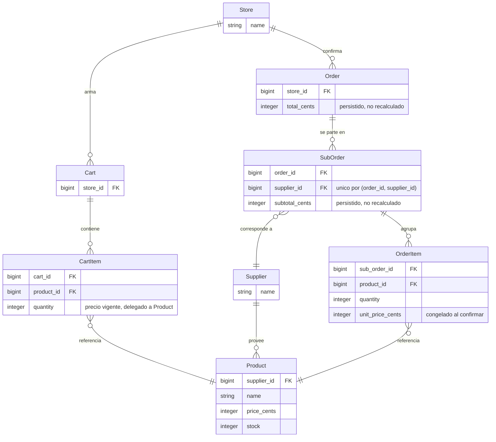

# marketplace-b2b

Marketplace donde tiendas pueden comprar productos a otros proveedores.

Una tienda arma un carrito con productos de varios proveedores. Al confirmar la compra se crea una
orden con **una suborden por proveedor**, y cada item queda con el precio congelado al momento de la
compra.

## Estado actual: carrito y checkout listos

Terminado y con tests:

- Esquema completo de las ocho tablas del dominio, con FKs indexadas y constraints en la base.
- Modelos con asociaciones, validaciones de negocio y cálculo de subtotales y total.
- Seeds idempotentes: 1 tienda, 5 proveedores, 3 productos por proveedor, con precios y stock
  distintos.
- Catálogo de solo lectura en la raíz (`/`), agrupado por proveedor, con precio y stock.
- Helper `format_money` para las vistas, con aritmética entera (sin floats).
- Carrito: agregar producto desde el catálogo (suma cantidad si ya estaba), ver contenido con
  subtotales y total, actualizar cantidad y quitar items. Flujo clásico con redirect, sin Hotwire.
- `current_store` y `current_cart` en `ApplicationController`: la tienda única de los seeds y el
  carrito persistido en DB con `cart_id` en sesión.
- Checkout: botón "Confirmar" en el carrito, `Orders::CreateOrder` arma la `Order` con una
  `SubOrder` por proveedor y sus `OrderItem` con precio congelado, y `OrdersController` muestra el
  desglose de la orden confirmada.
- Listado de órdenes en `/orders`, accesible desde la nav bar: fecha y total por orden, tomados
  directo de las columnas `created_at` y `total_cents` (sin recorrer subórdenes ni items), con link
  al detalle de cada una.

## Cómo correrlo

Requiere PostgreSQL corriendo y Ruby 3.4.9 (fijado en `.ruby-version`).

```bash
bin/setup                      # instala dependencias y prepara la base
bin/rails db:prepare db:seed   # crea/migra y carga datos iniciales
bin/rails server               # levanta la app
bin/rails test                 # corre los tests
bin/rubocop                    # lint
```

## Dominio: la orden se parte en subórdenes por proveedor



`SubOrder` expone su subtotal (`subtotal_cents`) y `Order` su total general (`total_cents`). Ambos
quedan persistidos como columnas al confirmar la compra, calculados una sola vez a partir de los
items (que ya tienen el precio congelado); no se recalculan en lecturas posteriores.

## Decisiones y trade-offs

### El carrito es su propio modelo, no una orden en borrador

La alternativa evaluada fue usar `Order` con un estado `draft` y mostrarla como carrito en la UI.
Se descartó porque `OrderItem` y el carrito tienen semánticas de precio opuestas.

`OrderItem` existe para congelar `unit_price_cents`. El carrito necesita lo contrario: mostrar
siempre el precio vigente del catálogo. Reusarlo obligaba a escribir un precio que no es el de la
compra, o a dejar la columna nullable y perder la constraint que sostiene la regla.

El efecto dominó era peor que la tabla extra: haría falta una columna de estado, `sub_order_id`
nullable en los items, y un filtro por estado en toda consulta de órdenes.

**Consecuencia:** `CartItem#unit_price_cents` delega en `product.price_cents`, mientras
`OrderItem#unit_price_cents` es una columna congelada. Es la asimetría central del dominio y ambos
modelos la comentan: `CartItem` sobre `unit_price_cents` (por qué no se congela), `OrderItem` sobre
`subtotal_cents` (por qué nunca se suma leyendo `product.price_cents`).

La asimetría además dejó de ser solo de precio: `CartItem` reserva y devuelve stock en callbacks de
su propio ciclo de vida (ver "Confirmar la compra vacía el carrito sin devolver el stock"), algo que
`OrderItem` no hace. Con una `Order` en `draft`, esos callbacks habrían quedado colgados del ciclo
de vida de la orden.

### Dinero en enteros y totales persistidos, no recalculados

Todos los importes son `*_cents` enteros. Nunca floats.

`orders.total_cents` y `sub_orders.subtotal_cents` son columnas, no métodos calculados. La decisión
original era lo contrario (derivar la suma de los items en Ruby en cada lectura, para resolver un
eventual N+1 con `includes` en vez de pegarle a la base por suborden). Se revirtió porque acceder al
total de una orden histórica sin recorrer sus items importa más que ese N+1 hipotético — en la
práctica leer el total pasa a ser un `SELECT` directo.

`Orders::CreateOrder` calcula ambos valores una sola vez, dentro de la misma transacción del
checkout, a partir de `OrderItem#unit_price_cents` ya congelado (nunca de `product.price_cents`).
Como una orden nunca se edita después de confirmada, el valor persistido no puede quedar
desactualizado respecto a sus items. `OrderItem` no tiene un subtotal propio en columna: es un solo
producto, no una suma, no hay nada que denormalizar ahí.

### Las reglas críticas viven también en la base

Las validaciones de ActiveRecord dan mensajes usables en la UI. Las constraints de PostgreSQL
garantizan que la regla no se pueda violar ni con un bug que saltee el modelo.

| Constraint | Regla que sostiene |
| --- | --- |
| `CHECK (quantity > 0)` en `cart_items` y `order_items` | Las cantidades son enteros estrictamente positivos |
| Único `(order_id, supplier_id)` en `sub_orders` | Exactamente una suborden por proveedor |
| Único `(cart_id, product_id)` en `cart_items` | Agregar dos veces el mismo producto suma cantidades |
| `unit_price_cents NOT NULL` en `order_items` | Una orden histórica nunca queda sin su precio de referencia |
| `CHECK (total_cents >= 0)` en `orders` | El total persistido nunca queda negativo |
| `CHECK (subtotal_cents >= 0)` en `sub_orders` | El subtotal persistido nunca queda negativo |

### Sin autenticación, con un punto de extensión explícito

No hay login ni roles. `current_store` en `ApplicationController` devuelve la única tienda de los
seeds, aislado en un solo método para que se vea dónde entraría la autenticación real.
`current_cart` vive al lado: busca el carrito por `session[:cart_id]` y crea uno nuevo si no existe,
sin exponer la sesión al resto de la app.

### `Cart#add_product` valida antes de sumar, no suma y después valida

Agregar un producto que ya está en el carrito debe sumar la cantidad, no duplicar el item (lo
sostiene el único `(cart_id, product_id)`). La tentación es sumar con `quantity.to_i` y validar
después, pero el cast a entero de Ruby es permisivo: `"1.5".to_i` da `1`, así que una cantidad
inválida se colaría redondeada en vez de rechazarse.

La validación `numericality only_integer` de Rails evita esto porque compara contra el valor *antes*
del cast (`CartItem.new(quantity: "1.5").quantity` ya vale `1`, pero sigue siendo inválido). Por eso
`add_product` asigna la cantidad cruda, valida, y solo si `errors[:quantity]` queda vacío arma la
suma con el entero ya validado. Si es inválida, no se persiste nada y el item existente no se toca.

### Confirmar la compra vacía el carrito sin devolver el stock

`Orders::CreateOrder` limpia el carrito con `cart.cart_items.delete_all` (DELETE directo por SQL)
en vez de `destroy_all` o destruir cada item. `CartItem#after_destroy :release_stock` existe
justamente para devolver al catálogo el stock de un item que se saca del carrito sin comprarlo; acá
pasa lo contrario, ese stock ya reservado se está convirtiendo en un `OrderItem` real. Si se usara
`destroy_all`, cada callback devolvería el stock que la orden recién creada necesita, dejando el
producto con más stock del que en realidad tiene disponible. Por eso el service no vuelve a tocar
`product.stock` en ningún punto: ya se reservó al tocar el carrito.

Al vivir dentro de la misma transacción que la creación de la orden, un fallo a mitad de camino
revierte ambas cosas: no queda orden parcial y el carrito tampoco se vacía.

### Generación de la app sin componentes fuera de alcance

La app se generó sin Hotwire, Solid Cache/Queue/Cable, Docker, Kamal, Thruster ni CI de GitHub. El
deploy y el trabajo en background están fuera de alcance, y Solid arrastraba tres esquemas extra con
sus migraciones.

Hotwire se evaluará sólo si simplifica algo concreto. Por ahora el flujo es formulario clásico con
redirect.

### Locale por defecto en español

Probando el flujo de agregar al carrito con una cantidad inválida apareció el mensaje "Quantity
must be an integer": Rails usa `:en` por defecto y ninguna vista lo pisaba, así que el único texto
que salía en inglés era el de las validaciones (todo lo demás está escrito directo en español en
las vistas, sin I18n). Se fijó `config.i18n.default_locale = :es` y se agregó
`config/locales/es.yml` con las traducciones que hoy se muestran (mensajes de `CartItem#quantity` y
`#product`). Al agregar validaciones nuevas que lleguen a la UI, hay que sumarlas ahí.

## Limitaciones conocidas

Son decisiones tomadas a conciencia para acotar el MVP, no bugs pendientes.

- **Sin manejo de concurrencia en stock.** La reserva ocurre al tocar el carrito (crear o aumentar
  un `CartItem` descuenta `product.stock`; reducirlo o destruirlo lo devuelve), sin locking
  optimista. Dos carritos simultáneos pueden competir por el mismo stock: en vez del mensaje de
  validación de siempre, una carrera real puede terminar en una excepción sin manejar al chocar
  contra el `CHECK (stock >= 0)`, que sigue como red de seguridad para que la base nunca quede
  inconsistente.
- **La reserva de stock solo se libera por una acción directa sobre `CartItem`.** No hay
  cancelación de orden ni limpieza de carritos abandonados que también la disparen (ver el punto
  siguiente), así que un carrito armado y nunca tocado de nuevo deja ese stock reservado
  indefinidamente.
- **No se pueden borrar productos ni proveedores.** Es el supuesto elegido para el caso de un
  producto que desaparece mientras está en un carrito. Se implementa con
  `dependent: :restrict_with_error`, así que el intento falla con un error de validación.
- **Carritos abandonados sin limpieza.** El carrito es una fila persistida y nada la borra si la
  tienda nunca confirma la compra. Es el costo aceptado de tener validaciones de ActiveRecord y
  tests simples — y ahora también significa que el stock que ese carrito reservó queda retenido
  fuera del catálogo mientras el carrito exista.
- **Una sola tienda.** Viene de los seeds y no hay forma de crear otra desde la UI.
- **El checkout no vuelve a validar stock al confirmar.** La cantidad ya se validó (y reservó)
  contra el stock disponible al tocar el carrito; agregar un segundo chequeo en
  `Orders::CreateOrder` sería redundante en el camino feliz y no cierra el hueco real, que es la
  falta de locking optimista ya documentada arriba.

## Supuestos

- **Una sola tienda, sin autenticación.** El enunciado ya lo fija así (`Store` única, creada en
  seeds); `current_store` devuelve `Store.first` en vez de resolver un usuario logueado.
- **No se pueden borrar productos ni proveedores.** Es el supuesto elegido para el caso "producto
  eliminado o despublicado mientras está en el carrito": en vez de soft-delete o un estado
  `discontinued`, se restringe el borrado con `dependent: :restrict_with_error`. Un producto que ya
  fue vendido o está en algún carrito nunca desaparece por debajo de esas referencias.
- **El carrito siempre refleja el precio vigente del catálogo**, no un precio reservado. El
  congelamiento de `unit_price_cents` es exclusivo de la compra confirmada (`OrderItem`); mientras un
  producto está en el carrito, subir o bajar su precio en el catálogo se ve reflejado ahí también. El
  stock no sigue esta regla: se reserva al agregar el item (ver el supuesto siguiente).
- **El stock se reserva al tocar el carrito, no al confirmar la compra**, para evitar sobreventa
  mientras el producto sigue "disponible" en el catálogo para otro carrito. El costo aceptado es que
  ese stock queda retenido aunque la compra nunca se confirme (ver "Limitaciones conocidas").
- **No hay control de concurrencia (sin locking optimista) sobre el stock.** Se asume un volumen de
  uso bajo, compatible con una sola tienda operando sin usuarios simultáneos reales; por eso una
  carrera entre dos requests tocando el mismo producto no está resuelta más allá del `CHECK (stock >=
  0)` de la base como red de seguridad.

## Casos borde cubiertos y dejados fuera

**Cubiertos** (con test automatizado):

- Orden con productos de 2 o más proveedores → una suborden por proveedor, con los items correctos.
- Cambio de precio de un producto después de la compra → la orden histórica conserva el precio
  congelado.
- Fallo a mitad del checkout → no queda ninguna orden ni suborden parcial en la base (transacción
  completa).
- Cantidad 0, negativa o no entera al agregar o actualizar un item → rechazada con mensaje, tanto en
  el modelo como en el flujo HTTP del carrito.
- Carrito vacío → no se puede confirmar la compra (`EmptyCartError`, mensaje en el carrito).
- Agregar dos veces el mismo producto al carrito → suma la cantidad sobre el item existente, no crea
  un duplicado.
- Cantidad que excede el stock disponible al agregar o aumentar un item del carrito → rechazada sin
  descontar stock, incluyendo el caso de aumentar sobre un item que ya tenía parte de ese stock
  reservado.
- Producto eliminado mientras está en un carrito o en una orden → no aplica: no se puede borrar un
  producto referenciado (ver "Supuestos").

**Dejados fuera** (documentados como límite consciente del MVP, no como bug):

- **Stock insuficiente en el momento exacto de confirmar el checkout.** No hay un chequeo ni un test
  a ese nivel porque la cantidad ya se validó y reservó al tocar el carrito; el checkout confía en esa
  reserva y no vuelve a tocar `product.stock`.
- **Condiciones de carrera entre dos carritos compitiendo por el mismo stock.** Sin locking
  optimista, una carrera real puede terminar en una excepción sin manejar en vez de un mensaje de
  validación (ver "Limitaciones conocidas").
- **Liberación de stock por abandono de carrito.** Un carrito armado y nunca confirmado ni tocado de
  nuevo deja su stock reservado indefinidamente; no hay job ni proceso que lo libere.
- **Multi-tienda y autenticación.** Fuera de alcance explícito del enunciado.
- **Errores inesperados fuera del camino feliz del checkout** (por ejemplo, una excepción que no sea
  `EmptyCartError`) no tienen un mensaje de UI dedicado y propagarían un error 500 real.

## Qué cambiaría para producción

- **Autenticación y multi-tienda reales.** Reemplazar `current_store = Store.first` por un login
  que resuelva la tienda del usuario, y permitir crear más de una tienda.
- **Locking sobre el stock.** Agregar `lock_version` (locking optimista) o `with_lock` en las
  operaciones de `CartItem` para cerrar la condición de carrera ya documentada en "Limitaciones
  conocidas", en vez de depender solo del `CHECK (stock >= 0)` como red de seguridad.
- **Manejo de errores inesperados en el checkout.** Hoy `OrdersController` solo rescata
  `EmptyCartError`; cualquier otra excepción (por ejemplo, la de una carrera de stock) da un 500
  real. Sumaría una excepción de dominio específica para ese caso, con su propio mensaje, en vez de
  dejar que se propague.
- **Limpieza de carritos abandonados.** Un job periódico que libere el stock reservado y borre
  carritos viejos sin confirmar, hoy inexistente.
- **Observabilidad.** Logging estructurado y reporte de errores (Sentry/Honeybadger o similar) para
  detectar en producción los casos hoy no manejados, en vez de depender de que un usuario reporte un
  500.
- **Revisar configuración de producción propia de Rails**: credenciales, backups de la base,
  variables de entorno y HTTPS, que hoy no se ejercitaron porque el alcance es solo desarrollo/tests.

## Próximos pasos

- **Chequeo de stock explícito en el checkout**, con su propio mensaje de error y test dedicado, en
  vez de confiar únicamente en la reserva hecha al tocar el carrito.
- **Locking optimista o pesimista sobre `Product#stock`** para eliminar la condición de carrera
  entre carritos simultáneos.
- **Job de limpieza de carritos abandonados** que libere el stock reservado después de un tiempo de
  inactividad.
- **Tests de sistema/integración end-to-end** (por ejemplo con Capybara) que ejerciten el flujo
  completo catálogo → carrito → checkout a través del navegador, complementando los tests de
  modelo/servicio/controller actuales.
- **Panel simple de administración** de productos y proveedores (alta, edición, baja controlada),
  hoy fuera de alcance y sostenido solo por los seeds.
- **Integración con una plataforma de pagos real**, hoy inexistente: la confirmación de la orden no
  cobra nada, solo registra la compra.
- **Contacto con el proveedor** una vez confirmada la orden (por ejemplo, notificarle su suborden),
  hoy fuera de alcance: las subórdenes quedan registradas pero no se comunican a nadie.
- **Recomendaciones debajo del carrito**, sugiriendo productos relacionados a los que ya están
  agregados (por ejemplo, complementarios del mismo proveedor o comprados juntos con frecuencia).
- **Proveedores con productos similares**, para que la tienda descubra alternativas de catálogo sin
  salir del flujo de compra.
- **Buscador de proveedores**, por nombre u otro criterio, hoy inexistente (solo se navegan
  agrupados en el catálogo).
- **Buscador de productos en el catálogo**, por nombre u otro criterio, para no depender de
  desplazarse por todo el listado agrupado por proveedor.
- **Sistema de reseñas para proveedores**, para que las tiendas dejen y consulten calificaciones y
  comentarios antes de comprarles, hoy inexistente.

## Fuera de alcance

Auth, roles, pagos, impuestos, envíos, integraciones, imágenes, panel de admin, emails y deploy.

## Uso de IA

El registro de qué se pidió, qué se aceptó y qué se cambió está en [docs/ai-usage.md](docs/ai-usage.md).
