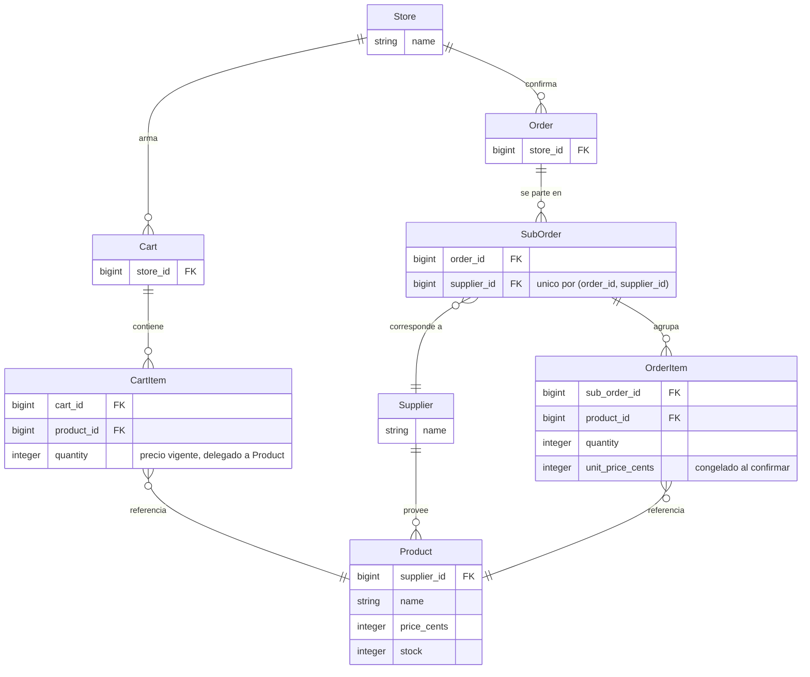

# marketplace-b2b

Marketplace donde tiendas pueden comprar productos a otros proveedores.

Una tienda arma un carrito con productos de varios proveedores. Al confirmar la compra se crea una
orden con **una suborden por proveedor**, y cada item queda con el precio congelado al momento de la
compra.

## Estado actual: el modelo de datos está completo, falta la interfaz

Terminado y con tests:

- Esquema completo de las ocho tablas del dominio, con FKs indexadas y constraints en la base.
- Modelos con asociaciones, validaciones de negocio y cálculo de subtotales y total.

Pendiente:

- Seeds, catálogo, carrito, checkout y tests de integración.
- Helper de formateo de dinero para las vistas.

## Cómo correrlo

Requiere PostgreSQL corriendo y Ruby 3.4.9 (fijado en `.ruby-version`).

```bash
bin/setup                      # instala dependencias y prepara la base
bin/rails db:prepare db:seed   # crea/migra y carga datos iniciales
bin/rails server               # levanta la app
bin/rails test                 # corre los tests
bin/rubocop                    # lint
```

## Dominio: la orden se parte en subórdenes por proveedor



`SubOrder` expone su subtotal y `Order` su total general. Ambos se derivan de los items, que ya
tienen el precio congelado.

## Decisiones y trade-offs

### El carrito es su propio modelo, no una orden en borrador

La alternativa evaluada fue usar `Order` con un estado `draft` y mostrarla como carrito en la UI.
Se descartó porque `OrderItem` y el carrito tienen semánticas de precio opuestas.

`OrderItem` existe para congelar `unit_price_cents`. El carrito necesita lo contrario: mostrar
siempre el precio vigente del catálogo. Reusarlo obligaba a escribir un precio que no es el de la
compra, o a dejar la columna nullable y perder la constraint que sostiene la regla.

El efecto dominó era peor que la tabla extra: haría falta una columna de estado, `sub_order_id`
nullable en los items, y un filtro por estado en toda consulta de órdenes.

**Consecuencia:** `CartItem#unit_price_cents` delega en `product.price_cents`, mientras
`OrderItem#unit_price_cents` es una columna congelada. Es la asimetría central del dominio y está
comentada en ambos modelos.

### Dinero en enteros y totales calculados, no denormalizados

Todos los importes son `*_cents` enteros. Nunca floats.

Los subtotales se derivan de los items en vez de guardarse en columnas. La suma se hace en Ruby y no
en SQL, para que un eventual N+1 se resuelva con `includes` desde el controller en lugar de pegarle
a la base una vez por suborden.

### Las reglas críticas viven también en la base

Las validaciones de ActiveRecord dan mensajes usables en la UI. Las constraints de PostgreSQL
garantizan que la regla no se pueda violar ni con un bug que saltee el modelo.

| Constraint | Regla que sostiene |
| --- | --- |
| `CHECK (quantity > 0)` en `cart_items` y `order_items` | Las cantidades son enteros estrictamente positivos |
| Único `(order_id, supplier_id)` en `sub_orders` | Exactamente una suborden por proveedor |
| Único `(cart_id, product_id)` en `cart_items` | Agregar dos veces el mismo producto suma cantidades |
| `unit_price_cents NOT NULL` en `order_items` | Una orden histórica nunca queda sin su precio de referencia |

### Sin autenticación, con un punto de extensión explícito

No hay login ni roles. `current_store` en `ApplicationController` devuelve la única tienda de los
seeds, aislado en un solo método para que se vea dónde entraría la autenticación real.

### Generación de la app sin componentes fuera de alcance

La app se generó sin Hotwire, Solid Cache/Queue/Cable, Docker, Kamal, Thruster ni CI de GitHub. El
deploy y el trabajo en background están fuera de alcance, y Solid arrastraba tres esquemas extra con
sus migraciones.

Hotwire se evaluará sólo si simplifica algo concreto. Por ahora el flujo es formulario clásico con
redirect.

## Limitaciones conocidas

Son decisiones tomadas a conciencia para acotar el MVP, no bugs pendientes.

- **Sin manejo de concurrencia en stock.** La disponibilidad se valida y se descuenta dentro de la
  transacción del checkout, sin reservas ni locking optimista. Dos compras simultáneas del mismo
  producto pueden competir por el mismo stock. El `CHECK (stock >= 0)` evita que la base quede
  inconsistente, pero el error le llega al segundo comprador recién al confirmar.
- **No se pueden borrar productos ni proveedores.** Es el supuesto elegido para el caso de un
  producto que desaparece mientras está en un carrito. Se implementa con
  `dependent: :restrict_with_error`, así que el intento falla con un error de validación.
- **Carritos abandonados sin limpieza.** El carrito es una fila persistida y nada la borra si la
  tienda nunca confirma la compra. Es el costo aceptado de tener validaciones de ActiveRecord y
  tests simples.
- **Una sola tienda.** Viene de los seeds y no hay forma de crear otra desde la UI.

## Fuera de alcance

Auth, roles, pagos, impuestos, envíos, integraciones, imágenes, panel de admin, emails y deploy.

## Uso de IA

El registro de qué se pidió, qué se aceptó y qué se cambió está en [docs/ai-usage.md](docs/ai-usage.md).
